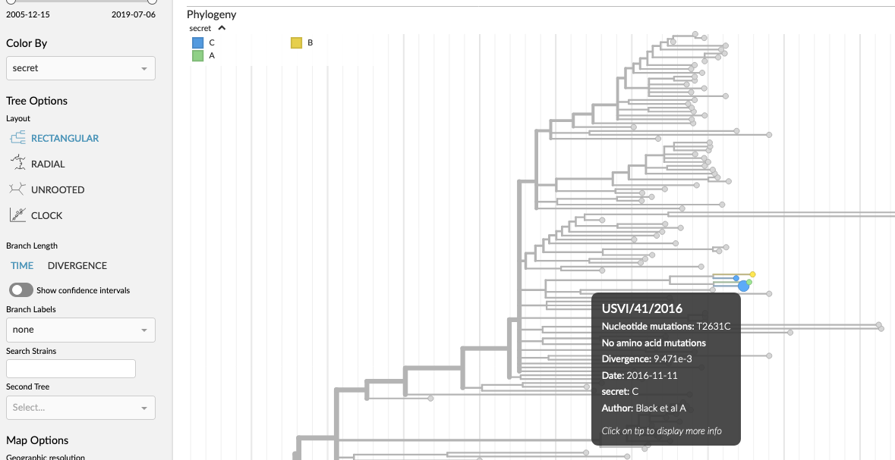
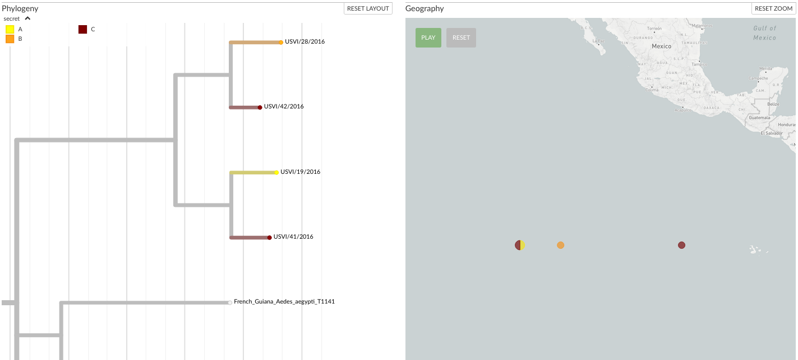

Drag-and-drop extra metadata
============================

Auspice (and `auspice.us <https://auspice.us>`__) allows dragging-and-dropping of metadata files onto a tree.
This is useful for seeing private data in a builds, as the additional data never leaves your browser.

.. note::

  Page updated May 2026 to reflect the additional capabilities in `Auspice 2.71.0 <https://github.com/nextstrain/auspice/releases/tag/v2.71.0>`__

**Table of contents:**

.. contents::
   :local:

Data files & formats
--------------------

CSV, TSV, XLSX files
____________________

The first row of a file is the header row, where the column names are used for the coloring to be added.
The first column defines the strain (node) names, and will be matched against the dataset's ``node.name`` properties.

Columns will be interpreted in one of the following ways:
  1. as a new coloring to add (use the sidebar "color-by" dropdown to select the new coloring)
  2. columns which already exist as a color-by in the dataset will be merged (see :ref:`merging-behaviour`)
  3. certain column names will be interpreted as providing color of geographical (lat-long) information (see :ref:`defining-colors` and :ref:`defining-geography`)
  4. certain columns are skipped (see :ref:`ignored-columns`)

Currently color scales are always categorical for these file types.
The general format is compatible with other popular tools such as `MicroReact <https://microreact.org/>`__.

An additional color-by is automatically added to represent which strains (tips) were present in the dropped-file.
This allows easy filtering to the subset of data contained in the CSV/TSV.

.. note::

  Excel files with file extension ``.xlsx`` are supported, but the metadata must be in the first sheet of the workbook.
  Older Excel files (with a ``.xls`` extension) are not supported.

Node Data JSONs
_______________

Node-data JSON files, which are commonly found in Augur bioinformatics pipelines, may also be dragged on.
Their format allows for slightly expanded capabilities, but data will still be added as a new color-by or merged with an existing one similar to CSV/TSV files.

.. code:: js

  {
    "nodes": {
      NODE_NAME: {
        PROPERTY: VALUE
      }
    }
  }

Numeric values will result in continuous color scales, boolean values with boolean scales, and everything else with categorical scales.
Mixed value types are not allowed.
Entropy and confidence values can be specified via ``${PROPERTY}_entropy`` and ``${PROPERTY}_confidence`` keys, respectively, following the established pattern in Augur.

Examples
--------

A :download:`small TSV file <../assets/extra-data.tsv>` with the following data:

.. csv-table::
   :file: ../assets/extra-data.tsv
   :delim: tab

can be dragged onto `nextstrain.org/zika <https://nextstrain.org/zika>`_ to add a "secret" color-by:

   Auspice with extra data shown via TSV

A :download:`more complex TSV file <../assets/extra-data-2.tsv>` can add more data to make use of additional features available:

.. csv-table::
   :file: ../assets/extra-data-2.tsv
   :delim: tab

This defines colours for the metadata (e.g. ``A`` is yellow, ``B`` is orange) as well as associating strains with (made up) geographic coordinates.  When dragged onto `nextstrain.org/zika`_, it looks like:

   Auspice with extra data shown via TSV

.. _merging-behaviour:

Merging behaviour
-----------------

Columns for which data exists already in the dataset will be merged together, with new data overwriting existing values.
This also applies for any :ref:`provided colors <defining-colors>`.

Since all data in CSV, TSV & XLSX files are interpreted as categorical this will only work if the existing data is also categorical.

.. _defining-colors:

Defining colors
---------------

By default, Auspice will create a color scale for new colorings with values ordered by occurrence in across the tree.
For existing colorings where we are merging in new data, new values will be assigned a greyscale color as they are missing from the existing scale.

To control this, colors may be provided by using a ``${COLUMN_NAME}__color`` (or ``${COLUMN_NAME}__colour``) column.
Values must be `hexadecimal color codes <https://en.wikipedia.org/wiki/Web_colors#Hex_triplet>`__ such as ``#3498db`` (blue); if there are multiple color values for the same metadata value then we'll average the color.
If the provided metadata is being merged with an existing coloring then any provided color will override the existing one.

.. _defining-geography:

Defining geographic locations
-----------------------------

If the columns ``latitude`` and ``longitude`` exist (or ``__latitude`` and ``__longitude``) then you can see these samples on the map.
This means that there will be a new geographic resolution available in the sidebar dropdown, labelled the same as the metadata filename you dropped on, which will plot the location on the map for those samples in the metadata file for which you provided positions for.

Additional metadata of this format defines lat-longs *per-sample*, which is different to Nextstrain's approach where we associate a location to a metadata trait.
To resolve this, we create a new (placeholder) trait whose values represent the unique lat/longs provided.
In the above example screenshot, note that auspice groups ``USVI/19/2016`` and ``USVI/42/2016`` together on the map as their lat/longs are identical; the other metadata columns (e.g. ``secret``) are not relevant for geography.

.. note::

  If the dataset itself doesn't contain any geographic data, then adding metadata will trigger the map to be displayed.

.. _ignored-columns:

Ignored columns
---------------

The following column names are currently ignored:

.. code:: yaml

   name
   div
   vaccine
   labels
   hidden
   mutations
   url
   authors
   accession
   traits
   children
   date
   num_date
   year
   month
   day

Fields which end with certain strings are treated as follows:

   - ``__autocolour``: this suffix is dropped, but the column is otherwise parsed as normal
   - ``__colour``: see above section on adding colours
   - ``__shape``: this column is currently ignored

Privacy
-------

All data added via these additional metadata files remains in-browser, and doesn't leave your computer. This makes it safe for sensitive data.
