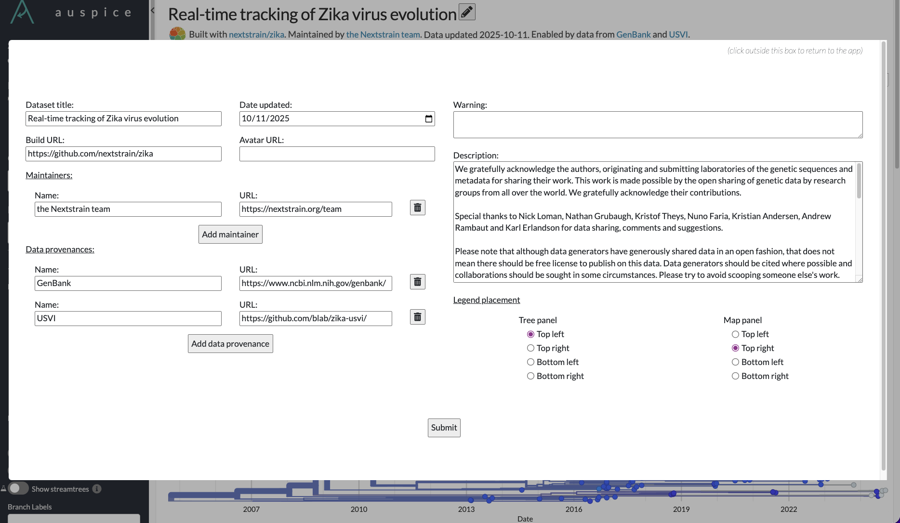
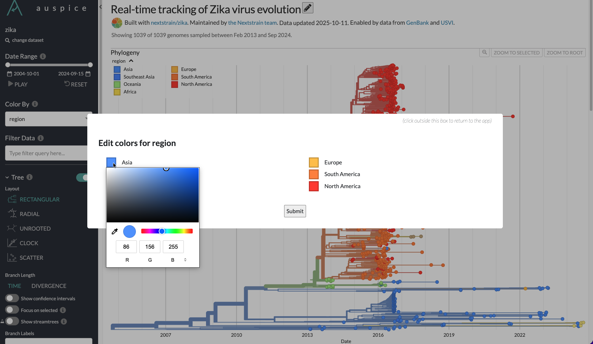

================
Editing Datasets
================

A subset of dataset features are editable within Auspice.

.. warning::

  Your edits will be erased if you refresh the webpage!

Dataset metadata
================

The following dataset metadata fields that are usually set with ``augur export``
are editable within Auspice. See `the JSON schema <https://nextstrain.org/schemas/dataset/v2>`__
for more details.

* ``meta.title``
* ``meta.updated``
* ``meta.build_url``
* ``meta.build_avatar``
* ``meta.description``
* ``meta.warning``
* ``meta.maintainers``
* ``meta.data_provenance``

Legend placement is customizable only within Auspice and does not have a corresponding
field in the JSON schema. The legend placement will only be available
for panels that include the legend display, i.e. tree, map, and measurements.
The legend placement can be set to the four quadrants of the panel: top left,
top right, bottom left, and bottom right.

How to edit the metadata
------------------------

1. Click on the edit button to the right of the dataset title to open the editor modal.
2. Edit desired fields.
3. Click "Submit" to save changes locally.
4. Click outside the modal if you want to discard all changes.

Colors
======

Colors for the dataset are usually set with ``augur export`` as described in
`"Configuring colors scales and legends" <https://docs.nextstrain.org/en/latest/learn/augur-to-auspice.html#configuring-color-scales-and-legends>`__.
When colors are not configured, then Auspice will generate a suitable scale for the field.

If you would like to change any existing colors, it is possible to do so locally
within Auspice.

.. note::

   It is currently not possible to change colors for the Genotype coloring.

1. Change the "Color By" to the field that you want to edit.
2. Open the legend.
3. Shift-click on one of the legend swatches to open the editor modal.
4. Click on the color value that you would like to change.
5. Click "Submit" to save changes locally.
6. Click outside the modal if you want to discard all changes.

