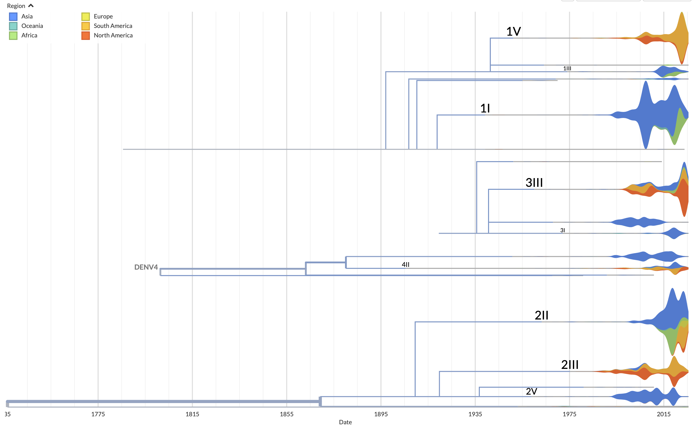

Streamtrees
===========

.. contents::
   :local:

Overview
--------

:term:`Streamtrees <streamtree>` are a novel visualisation approach to describe phylogenetic trees by rendering clades (mono- or para-phyletic) as a streamgraph.
They help with two distinct problems with phylogenetic trees:

1. Large trees (i.e. those with more than a few thousand tips) are both hard to interpret and computationally expensive, as the number of pixels available for each tip becomes miniscule. There have been a number of innovative approaches to address this such as `Taxonium's <https://taxonium.org>`__ progressive zoom where the number of nodes rendered changes according to the zoom level. Streamtrees replace a clade of :math:`n` tips (:math:`\sim 2n` nodes) with a streamtree with one :term:`ribbon` (:term:`stream`) per color-by category, which is both computationally easier to display and easier to interpret as :math:`n` becomes large.

2. Seeing the big themes in trees is often hindered by all branches given the same visual importance. For instance, seeing geographic jumps in a tree (where geographic ancestry has been inferred) may be difficult for many. Streamtrees may be created to partition the tree based on such jumps and the resulting visual separation of streams is often easier to interpret.

While streamtrees are currently implemented using a standard Auspice phylogenetic tree structure, it is conceivable to instead use a list of samples partitioned by metadata (e.g. nextclade-assigned lineages) and thus avoid the cost of inferring a tree.

|summary| *Figure 1. Streamtrees summarising all available (17k) Dengue virus genomes, with streamtrees conveying the genotype relationships and individual streams representing sample geography. The dataset remains performant and interactive despite large dataset sizes and we can switch to a more typical tree rendering as needed.*

Dataset requirements
--------------------

Streamtrees are created by using (internal) branch labels to partition the data, with all nodes below each label being displayed as streamtrees, one per label. A dataset can be displayed with "normal" nodes as well as streamtrees if the label does not appear on the root node. Multiple labels can be defined for a tree and a drop-down allows us to change the label in use.

You may use the :ref:`display default <dataset-configurable-defaults>` ``stream_label`` or :ref:`URL query <url-query-options>` ``streamLabel`` to start with streamtrees displayed using a specific label. Similarly you may set the (optional) JSON value ``.meta.stream_labels: string[]`` to limit the branch labels that are considered for streamtrees.

Note: It is possible to create datasets which have labels for which there are no associated tips (as all descendent tips get assigned to other labels). Rendering of streamtrees is not perfect with such datasets as we don't render the internal-only streamtree and thus there's a visual break between connected streamtrees.

User interactions
-----------------

Most of the typical interactions available in Auspice are also available in streamtrees such as zooming, hovering, filtering etc.

A toggle and dropdown in the sidebar may be used to change how streamtrees are defined, and changes to the selected color-by will update the way an individual streamtree is decomposed into individual streams.

At the moment streamtrees are only available in rectangular tree views.

Terminology
-----------

.. glossary::

   streamtree
       A `streamgraph <https://en.wikipedia.org/wiki/Streamgraph>`__ (a type of stacked area graph which is symmetrical around the horizontal axis) which represents a monophyletic or paraphyletic set of nodes in the tree. The branch leading to the streamtree represents the (internal) node the defining branch label was on, but the streamtree itself only represents terminal nodes (tips). A dataset will typically be displayed as multiple streamtrees, although using a singular streamtree is also possible.

   ribbon
       A streamtree is partitioned into "categories" (via color-by metadata) and each category is drawn as a ribbon. For certain color-bys the entire streamtree may be a single ribbon. In *Figure 1* each ribbon represents tips from a specific geographic region.

   stream
       May refer to a streamtree or a ribbon (context dependent).

   pivots
       A grid of times or divergences (depending on the tree metric in use) which are used to evaluate the kernels associated with each tip. A consistent grid is used across streamtrees, although each streamtree typically only uses a subset of them.

Implementation details
----------------------

Summary of main steps
~~~~~~~~~~~~~~~~~~~~~

1. ``labelStreamMembership`` - traverses the tree, clearing any previous stream information and setting stream information on the root nodes of new streams.
   New streams are identified based on branch labels, so this function is called when streams are first toggled on (which may be when the dataset loads) as well as when the UI changes the stream branch label.

   This creates the mapping of stream name (via the branch label attached to the stream-start node) to an object describing various properties of the stream; see the type ``StreamSummary`` for more. Furthermore every node in the tree has the boolean property ``node.inStream`` set.

2. ``processStreams`` - computes a number of details about each stream, and may be called in a partial fashion in order to skip recomputations as needed. Each stream-start node will have the properties of the type ``StreamStartNode`` added to it via this function.

   * :term:`Pivots` for the entire dataset are calculated and a subset of pivots is assigned to each stream.
   * The rendering order for each set of connected streams is computed such that we avoid crossings of branches and streams; see the ``calcRenderingOrder`` function for more details.
   * Tips in each stream are partitioned via the current color scale
   * Each partition of tips is turned into a ribbon (in weight-space) by evaluating a kernel for each tip across the pivots in the stream and summing the weights. See "KDE calculations" below for more.

   This step is called on:

   * page load
   * change in branch-label
   * toggle stream tree
   * tree visibility updates
   * tree distance metric change

3. Rendering - the streamtree ribbons (in weight-space) are first transformed into display-order space and then to pixel space for rendering.

    .. note::  This code is all within ``PhyloTree``. Not all of these steps need to be called on each update, and not all are explicitly about streams.

    * ``setDisplayOrder``, ``setRippleDisplayOrders`` - sets ``displayOrder`` and ``displayOrderRange`` for the origin node of the stream. The former is the midpoint of the stream, the latter is the range the stream occupies. Also computes ``rippleDisplayOrders`` (on the stream start node) by converting the already set ``streamDimensions`` (sum of KDE weights) to an array of ripples in display-order space. The transform of weight-space to display-order space not only shifts the values (so that ultimately streams appear in different places on screen) but also scales them such that they don't dominate the display-orders set for normally-rendered tips; see ``weightToDisplayOrderScaleFactor`` for more.

    * ``setDistance`` - not required for streams

    * ``setLayout`` - not required for streams

    * ``mapToScreen``, ``mapStreamsToScreen`` - Computes ``streamRipples`` which are in pixel-space, based on ``rippleDisplayOrders`` and ``streamPivots``. The structure of ``streamRipples`` is a 3d matrix: ``streamRipples[categoryIdx][pivotIdx] = {x, y0, y1}``

    * ``drawStreams`` - d3 code to render ``streamRipples``, stream labels, and connectors (the branches joining streams to streams)

    .. note::  Many properties are still set on (or related to) nodes within a stream which don't need to be set, such as those set by ``setDistance`` and ``setLayout``,  branch thicknesses etc. We should be able to improve performance by ignoring these updates while stream-trees are in view.

KDE calculations
~~~~~~~~~~~~~~~~

Streams are a Kernel Density Estimate (KDE) with a Gaussian kernel to smooth out the contribution of each sampled sequence. Each kernel represents a sample with the kernel centered on the sampling date or divergence value and with a constant standard deviation

We calculate a underlying array of pivots spanning all tips (i.e. covering all streams) and extended slightly either side (so, e.g., the earliest sampled tip is not centered at the leftmost pivot). The standard deviation, :math:`\sigma`, of each kernel is a proportion of this pivot span and is thus the same across all kernels and streams. For each stream we use a subset of this list of pivots such that the pivots span the time range :math:`(t_{min} - 3\sigma, t_{max} + 3\sigma)`, where :math:`t_{min}, t_{max}` are the minimum and maximum tips in the stream according to divergence values or sampling dates, as appropriate. If :math:`t_{min} - 3\sigma < t_{stream\ start}` then we set the minimum pivot to :math:`t_{stream\ start}` so that streams don't extend leftwards of the branch connecting to the stream.

These Gaussians are summed together to form the KDE :math:`\hat{f}(x) = \sum_{i=1}^{n} w \times \mathcal{N}(\mu,\,\sigma^{2})` where :math:`\mu` is the tip sampling date/divergence, :math:`\sigma` is a constant across all streams, and :math:`w` is a per-stream weight defined below. The PDF of the Gaussian is evaluated at each of the stream's pivots.

The weighting parameter :math:`w` scales each Gaussian proportional to the number of tips in the stream (:math:`m`) via a negative exponential :math:`w=\exp(\frac{-(m-4)}{4})+1`. This improves the interpretability of streams by increasing the rendering size of small streams (especially streams with a single tip), but we lose the ability to directly compare streams against one another.

