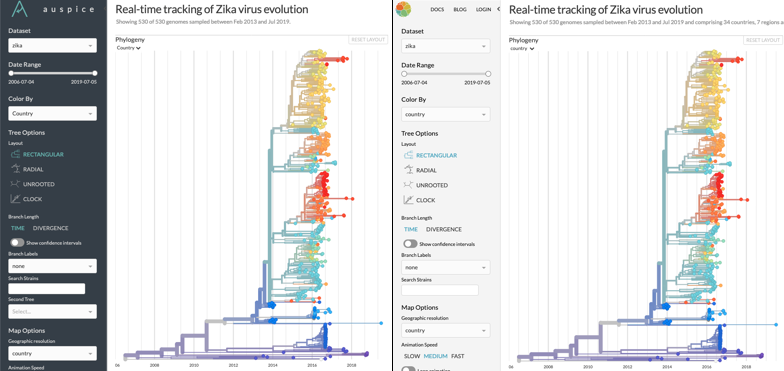

======================================
Overview (Client)
======================================

Auspice allows you to customise the appearance and functionality of Auspice `when the client is built <../introduction/how-to-run.html#auspice-build>`_.
This is how Auspice running locally and nextstrain.org look different, despite both using "Auspice".

*Notice the difference? Default Auspice (left) and nextstrain.org's customised version (right)*

This is achieved by providing a JSON at build time to Auspice which defines the desired customisations via:

 .. code-block:: bash

   auspice build --extend <JSON>

`Here's <https://github.com/nextstrain/nextstrain.org/blob/master/auspice-client/customisations/config.json>`_ the file used by nextstrain.org to change the appearance of Auspice in the above image.

See the `client customisation API <api.html>`_ for the available options.

AGPL Source Code Requirement
============================

Auspice is distributed under `AGPL 3.0 <https://www.gnu.org/licenses/agpl-3.0.en.html>`_.
Any modifications made to the auspice source code, including build-time customisations as described here, must be made publicly available. 
We ask that the "Powered by Nextstrain" text and link, rendered below the data visualisations, be maintained in all customised versions of auspice, in keeping with the spirit of scientific citations.
