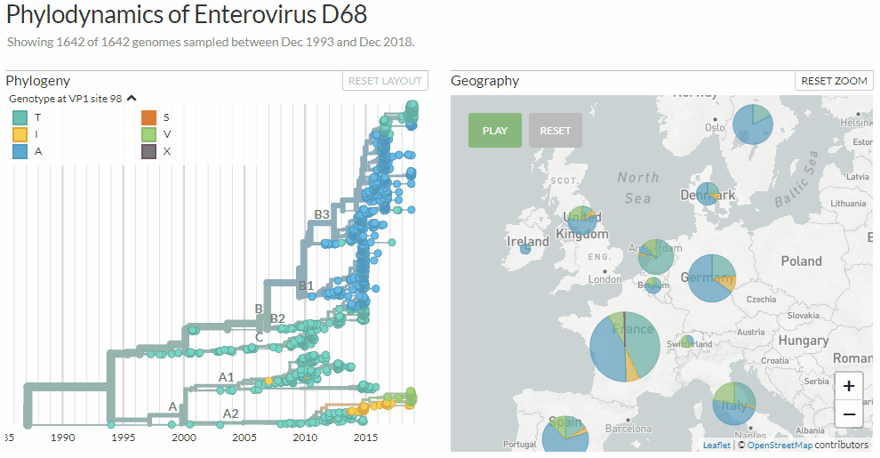

.. Auspice documentation master file, created by
   sphinx-quickstart on Fri Oct  2 10:18:35 2020.
   You can adapt this file completely to your liking, but it should at least
   contain the root `toctree` directive.

==========================================================================
Auspice: An Open-source Interactive Tool for Visualising Phylogenomic Data
==========================================================================

--------------------------------------------------------------------------------------------
*Auspice is software to display beautiful, interactive visualisations of phylogenomic data.*
--------------------------------------------------------------------------------------------

.. image:: assets/splash.png

*Auspice being used to show the spread of influenza H7N9 virus across Asia.*

Communicating scientific results while also allowing interrogation of the underlying data is an integral part of the scientific process.
Current scientific publishing practices hinder both the rapid dissemination of epidemiologically relevant results and the ability to easily interact with the data used to draw inferences.
These shortcomings motivated the `Nextstrain <https://nextstrain.org>`_ project, for which Auspice was initially devloped.

Auspice can be run on your computer or integrated into websites.
It allows easy customisation of aesthetics and functionality, and powers the visualisations on `nextstrain.org <https://nextstrain.org>`_.

For a more formal introduction to auspice & the wider nextstrain project, please see `Hadfield et al., Nextstrain: real-time tracking of pathogen evolution, Bioinformatics (2018) <https://academic.oup.com/bioinformatics/article/34/23/4121/5001388>`_.

*Exploring Enterovirus d68 by changing between three different colorings: clades, age-ranges & mutations at a certain genome position.*

License and Copyright
======================

Copyright © 2014-2020 Trevor Bedford and Richard Neher.

Source code to Nextstrain is made available under the terms of the `GNU Affero General Public License <LICENSE.txt>`_ (AGPL). Nextstrain is distributed in the hope that it will be useful, but WITHOUT ANY WARRANTY; without even the implied warranty of MERCHANTABILITY or FITNESS FOR A PARTICULAR PURPOSE.  See the GNU Affero General Public License for more details.

.. toctree::
   :maxdepth: 1
   :titlesonly:
   :caption: Introduction
   :hidden:

   introduction/install
   introduction/how-to-run

.. toctree::
   :maxdepth: 1
   :titlesonly:
   :caption: Functionality
   :hidden:

   advanced-functionality/second-trees
   advanced-functionality/view-settings
   advanced-functionality/drag-drop-csv-tsv
   advanced-functionality/misc

.. toctree::
   :maxdepth: 1
   :titlesonly:
   :caption: Customising Auspice
   :hidden:

   customise-client/overview
   customise-client/api
   customise-client/requests

.. toctree::
   :maxdepth: 1
   :titlesonly:
   :caption: Auspice servers
   :hidden:

   server/overview
   server/api
   server/authentication

.. toctree::
   :maxdepth: 1
   :titlesonly:
   :caption: Releases
   :hidden:

   releases/index

.. toctree::
   :maxdepth: 1
   :titlesonly:
   :hidden:

   Stuck? Ask us on the discussion board. We're happy to help! <https://discussion.nextstrain.org/>
