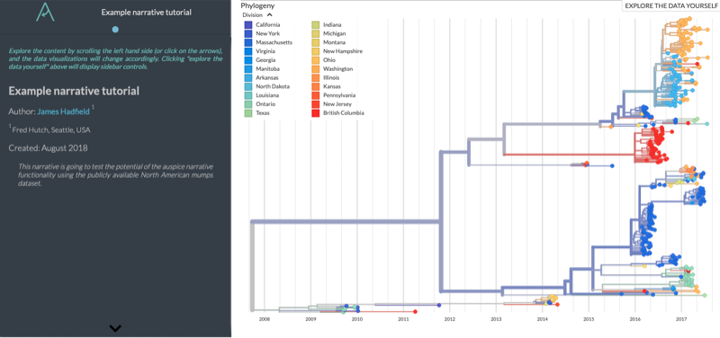
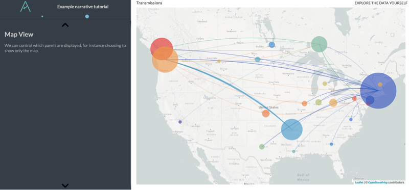

# Writing a Narrative
<!-- WARNING -->
<!-- Do not edit this file from within the docs.nextstrain.org repository. -->
<!-- It is fetched from another repository to be included in the docs.nextstrain.org build. -->
<!-- So, if you edit it after it is fetched into docs.nextstrain.org, your changes will be lost. -->
<!-- Instead, edit this file in its own repository and commit your changes there. -->
<!-- For more details on this (temporary) implementation, see https://github.com/nextstrain/docs.nextstrain.org#fetching-of-documents-from-other-repositories -->
<!-- This file is located at (fetched from): https://github.com/nextstrain/auspice/blob/master/docs/narratives/how-to-write.md -->
<!-- WARNING -->
<!-- WARNING -->
<!-- WARNING -->


This documentation will walk us through constructing a narrative from scratch, based on [this example (nextstrain.org)](https://nextstrain.org/narratives/intro-to-narratives).
If you run into any bugs, please [get in contact with us (email)](mailto:hello@nextstrain.org).

## Step 1: Get the Underlying Datasets

You can skip this step if you have generated your own dataset, but for the purposes of this tutorial we will need the mumps dataset.

```bash
mkdir datasets
curl http://data.nextstrain.org/mumps_na.json --compressed -o datasets/mumps_na.json
```

You should now be able to visualise the dataset (without any narrative functionality) via `auspice view --datasetDir datasets`

## Step 2: Start a Simple Narrative

We're going to start by creating a narrative with only one page (the title page).

```bash
mkdir narratives
touch narratives/example.md
```

Open up `narratives/example.md` and start by pasting in the following YAML frontmatter, which is used to define some basic set-up for the narrative and create the first narrative page.

```yaml
---
title: Example narrative tutorial
authors: "your name"
authorLinks: "url, twitter link, mailto etc"
affiliations: "your affiliation"
date: "August 2018"
dataset: "http://localhost:4000/mumps/na?d=tree"
abstract: "This narrative is going to test the potential of the Auspice narrative functionality using the publicly available North American mumps dataset."
---
```

The really important bit here is the `dataset` line -- this references the dataset we downloaded above.
(A [current limitation](../guides/communicate/narratives-intro.html#known-bugs-limitations) of narratives is that they cannot change the dataset.)


## Step 3: View the Narrative so Far

We don't really have much, but we can still load it up in Auspice and check it's working as expected. If it is, we will see a narrative with only one page.
```bash
auspice view --datasetDir datasets/ --narrativeDir narratives/
```
And you should see something like this at [localhost:4000/narratives/example](http://localhost:4000/narratives/example)




## Step 4: Adding a Paragraph

Each "paragraph" or page of the narrative is made up of a section of Markdown starting with a h1 heading, which is a link with text beneath.
It is these h1 headings that define when we have a new narrative pararaphs.

> If you're new to Markdown, take a look [at this page](https://github.com/adam-p/markdown-here/wiki/Markdown-Cheatsheet) to get started.

The heading is itself a link that defines the view of Auspice at that time.
You may have noticed that as you interact with Auspice -- for this example at [localhost:4000/mumps/na](http://localhost:4000/mumps/na) -- then the URL changes.
For instance, if we use the sidebar to toggle "off" the tree and entropy, just keeping the map then you'll see that the URL has changed to [localhost:4000/mumps/na?d=map](http://localhost:4000/mumps/na?d=map).
We're going to use this functionality to "save" the view of Auspice into the Markdown file, so that the narrative knows what view to show.

Let's use this knowledge to make a page in the narrative which switches to just show the map.
Add the following text to the narrative Markdown file:

```md
# [Map View](http://localhost:4000/mumps/na?d=map)

We can control which panels are displayed, for instance choosing to show only the map.

```

Now, we should have a second page available in the narrative:




## Step 5: Adding More Paragraphs

We're going to use the same iterative technique to add more pagragraphs:
1. Use Auspice ([localhost:4000/mumps/na](http://localhost:4000/mumps/na)) to change the view as you desire
2. Copy this URL and create a h1 header in the markdown file
3. Write some text in the Markdown to form the narrative paragraph
4. Repeat until happy 😁

You can see the contents of the Markdown file behind [the example (nextstrain.org)](https://nextstrain.org/narratives/intro-to-narratives) that we're basing this tutorial on [here](https://raw.githubusercontent.com/nextstrain/narratives/master/intro-to-narratives.md).
You can use this markdown file as inspiration for creating your own paragraphs, or just copy and paste the content!
For reference, here are three paragraphs from that file:

```md

# [Phylogenies](http://localhost:4000/mumps/na?d=tree&dmax=2014-07-14&dmin=2012-03-30&p=full)

Here we've returned to the tree and begun slicing time.

# [Explore clock signal](http://localhost:4000/mumps/na?d=tree&l=clock&p=full)

Different tree layouts are possible, this one shows the temporal
divergence vs. inferred substitutions to see the presence of a
constant clock signal.

# [Mutations I](http://localhost:4000/mumps/na?c=gt-SH_22&d=tree,entropy&p=full)

Here we have coloured the tree according to a single mutation (residue 22 in
the SH gene) where there are two variants present in this dataset -- yellow tips
have a Methionine (`M`) at this position, while aqua nodes indicate Isoleucine (`I`).

```


## Step 6: Upload Your Example to the Nextstrain Community to Share with Everyone

In the [narratives introduction](../guides/communicate/narratives-intro.html#sharing-narratives) we introduced the possibility of using the community functionality of Nextstrain to share your narratives.


> A quick reminder of the difference between Auspice & nextstrain.org is warranted.
Nextstrain is a "user" of Auspice, in that it uses Auspice to visualise genomic data and makes it available via [nextstrain.org](https://nextstrain.org).
It has additional functionality available, such as the ability to source datasets (and narratives!) from any public GitHub repo -- [see documentation here (nextstrain.org)](https://nextstrain.org/docs/contributing/community-builds).
Note that the _dataset_ (i.e. the JSON(s)) doesn't have to live in the same GitHub repo, in fact it doesn't even need to be a community build.


> This step requires knowledge of GitHub -- [see here](https://guides.github.com/activities/hello-world/) for an introduction.

If you turn the directory containing the `datasets` and `narratives` directories into a Git repository and upload it to your GitHub account, then you can share your narrative with anyone through Nextstrain.
For instance, let's assume your GitHub username is "yourname" and your repo is called "auspice-narrative-example". You'll need to rename the narrative markdown to start with the repo name, e.g.
```bash
mv narratives/example.md narratives/auspice-narrative-example.md
```
Then, by uploading the repo to GitHub it will be available to everyone at nextstrain.org/narratives/yourname/auspice-narrative-example.


This is how the narrative file at [GitHub > emmahodcroft > tb > narratives](https://github.com/emmahodcroft/tb/blob/master/narratives/tb_crispell.md) can be accessed via [nextstrain.org/community/narratives/emmahodcroft/tb/crispell](https://nextstrain.org/community/narratives/emmahodcroft/tb/crispell).
