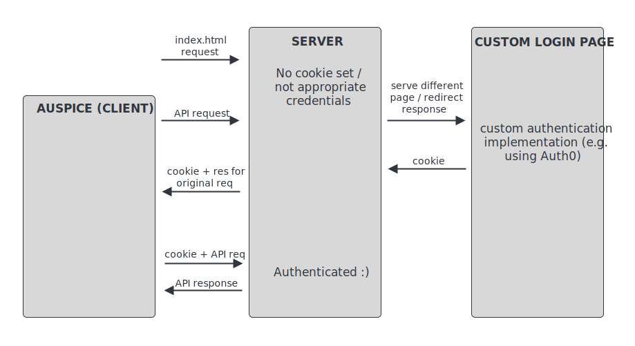

# Authentication

While Auspice was designed to facilitate open data sharing and rapid dissemination of results, it may be necessary to authenticate certain datasets (or indeed the entire instance).
Auspice itself contains no authentication ability, but if you are running a server then it is possible -- and relatively simple -- to build in authentication.

The exact implementation details are beyond the scope of this documentation, but the following provides an outline of the approach we have implemented for [nextstrain.org](https://nextstrain.org).

## Using the Server to Verify Cookies

The server can examine cookies sent with each API request (or, the request for `index.html`) to verify the status of a user.
This allows the server to examine the cookie and:
* Deliver different available datasets depending on the cookie
* Accept or reject specific dataset requests depending on the cookie
* Redirect requests to a custom authentication page (referred to as `login.html`)
  * If this is from a request for `index.html` (i.e. you want to secure the entire site), then the redirect is simple
  * For redirects from an API request, you may have to respond with a 302 or 303 redirect header.

It is this custom authentication page which can process a login and set a cookie appropriately.
As Auspice is served from the same domain, the cookie should remain with all requests.

Implementing authentication is beyond the scope of this documentation, but we can recommend [PassportJS](http://www.passportjs.org) and [Auth0](https://auth0.com/), the latter of which allows you to easily use single sign-on strategies.
